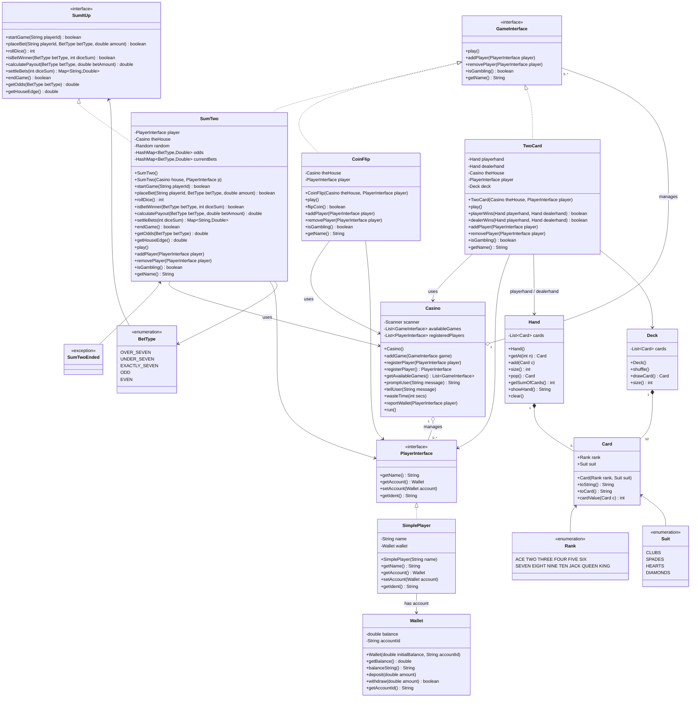

# NanoCasino – Class Diagram

```mermaid
classDiagram
    %% ── Interfaces ──────────────────────────────────────────────────────────

    class GameInterface {
        <<interface>>
        +play()
        +addPlayer(PlayerInterface player)
        +removePlayer(PlayerInterface player)
        +isGambling() boolean
        +getName() String
    }

    class PlayerInterface {
        <<interface>>
        +getName() String
        +getAccount() Wallet
        +setAccount(Wallet account)
        +getIdent() String
    }

    class SumItUp {
        <<interface>>
        +startGame(String playerId) boolean
        +placeBet(String playerId, BetType betType, double amount) boolean
        +rollDice() int
        +isBetWinner(BetType betType, int diceSum) boolean
        +calculatePayout(BetType betType, double betAmount) double
        +settleBets(int diceSum) Map~String,Double~
        +endGame() boolean
        +getOdds(BetType betType) double
        +getHouseEdge() double
    }

    class BetType {
        <<enumeration>>
        OVER_SEVEN
        UNDER_SEVEN
        EXACTLY_SEVEN
        ODD
        EVEN
    }

    %% ── Core classes ─────────────────────────────────────────────────────────

    class Casino {
        -Scanner scanner
        -List~GameInterface~ availableGames
        -List~PlayerInterface~ registeredPlayers
        +Casino()
        +addGame(GameInterface game)
        +registerPlayer(PlayerInterface player)
        +registerPlayer() PlayerInterface
        +getAvailableGames() List~GameInterface~
        +promptUser(String message) String
        +tellUser(String message)
        +wasteTime(int secs)
        +reportWallet(PlayerInterface player)
        +run()
    }

    class SimplePlayer {
        -String name
        -Wallet wallet
        +SimplePlayer(String name)
        +getName() String
        +getAccount() Wallet
        +setAccount(Wallet account)
        +getIdent() String
    }

    class Wallet {
        -double balance
        -String accountId
        +Wallet(double initialBalance, String accountId)
        +getBalance() double
        +balanceString() String
        +deposit(double amount)
        +withdraw(double amount) boolean
        +getAccountId() String
    }

    %% ── Games ────────────────────────────────────────────────────────────────

    class CoinFlip {
        -Casino theHouse
        -PlayerInterface player
        +CoinFlip(Casino theHouse, PlayerInterface player)
        +play()
        +flipCoin() boolean
        +addPlayer(PlayerInterface player)
        +removePlayer(PlayerInterface player)
        +isGambling() boolean
        +getName() String
    }

    class SumTwo {
        -PlayerInterface player
        -Casino theHouse
        -Random random
        -HashMap~BetType,Double~ odds
        -HashMap~BetType,Double~ currentBets
        +SumTwo()
        +SumTwo(Casino house, PlayerInterface p)
        +startGame(String playerId) boolean
        +placeBet(String playerId, BetType betType, double amount) boolean
        +rollDice() int
        +isBetWinner(BetType betType, int diceSum) boolean
        +calculatePayout(BetType betType, double betAmount) double
        +settleBets(int diceSum) Map~String,Double~
        +endGame() boolean
        +getOdds(BetType betType) double
        +getHouseEdge() double
        +play()
        +addPlayer(PlayerInterface player)
        +removePlayer(PlayerInterface player)
        +isGambling() boolean
        +getName() String
    }

    class SumTwoEnded {
        <<exception>>
    }

    class TwoCard {
        -Hand playerhand
        -Hand dealerhand
        -Casino theHouse
        -PlayerInterface player
        -Deck deck
        +TwoCard(Casino theHouse, PlayerInterface player)
        +play()
        +playerWins(Hand playerhand, Hand dealerhand) boolean
        +dealerWins(Hand playerhand, Hand dealerhand) boolean
        +addPlayer(PlayerInterface player)
        +removePlayer(PlayerInterface player)
        +isGambling() boolean
        +getName() String
    }

    %% ── Cards package ────────────────────────────────────────────────────────

    class Card {
        +Rank rank
        +Suit suit
        +Card(Rank rank, Suit suit)
        +toString() String
        +toCard() String
        +cardValue(Card c) int
    }

    class Rank {
        <<enumeration>>
        ACE TWO THREE FOUR FIVE SIX
        SEVEN EIGHT NINE TEN JACK QUEEN KING
    }

    class Suit {
        <<enumeration>>
        CLUBS
        SPADES
        HEARTS
        DIAMONDS
    }

    class Deck {
        -List~Card~ cards
        +Deck()
        +shuffle()
        +drawCard() Card
        +size() int
    }

    class Hand {
        -List~Card~ cards
        +Hand()
        +getAt(int n) Card
        +add(Card c)
        +size() int
        +pop() Card
        +getSumOfCards() int
        +showHand() String
        +clear()
    }

    %% ── Relationships ────────────────────────────────────────────────────────

    %% interface implementations
    GameInterface      <|..  CoinFlip
    GameInterface      <|..  SumTwo
    GameInterface      <|..  TwoCard
    SumItUp            <|..  SumTwo
    PlayerInterface    <|..  SimplePlayer

    %% SumItUp owns BetType enum
    SumItUp            <--   BetType

    %% inner exception of SumTwo
    SumTwo             <--   SumTwoEnded

    %% Card owns its enums
    Card               <--   Rank
    Card               <--   Suit

    %% associations
    SimplePlayer       -->   Wallet        : has account
    Casino             "1" o-- "0..*" GameInterface   : manages
    Casino             "1" o-- "0..*" PlayerInterface : manages
    CoinFlip           -->   Casino        : uses
    CoinFlip           -->   PlayerInterface
    SumTwo             -->   Casino        : uses
    SumTwo             -->   PlayerInterface
    SumTwo             -->   BetType
    TwoCard            -->   Casino        : uses
    TwoCard            -->   PlayerInterface
    TwoCard            -->   Hand          : playerhand / dealerhand
    TwoCard            -->   Deck
    Deck               "1" *-- "52" Card
    Hand               "1" *-- "0..*" Card
```
